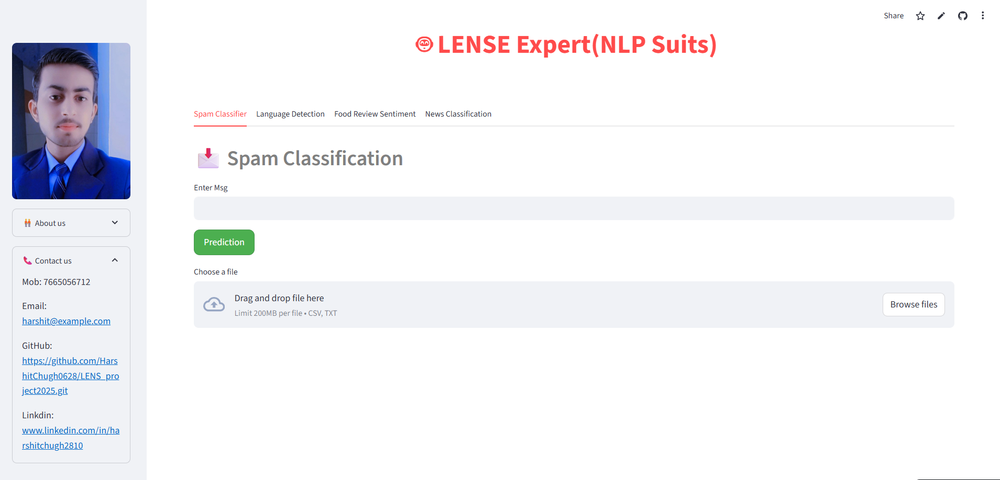

# 🤖 LENSE Expert - NLP Suite

LENSE (Language detection, Spam Classification, News classification, and Sentiment analysis for food reviews) is a smart **NLP-powered web app** built with Streamlit. This project demonstrates the power of machine learning in handling real-world Natural Language Processing tasks.

---

## 📌 Features

1. **📩 Spam Classification**
   - Detects whether a given message is spam or not.
   - Batch prediction supported via `.csv` or `.txt` file uploads.

2. **🌐 Language Detection**
   - Identifies the language of a given text.
   - Supports batch detection via file upload.

3. **🍔 Food Review Sentiment Analysis**
   - Classifies food reviews into **Amazing** or **Disappointing**.
   - Allows single input or bulk sentiment prediction.

4. **📰 News Classification**
   - Classifies news articles into categories like **Politics**, **Science**, **Sports**, **Tech**, etc.
   - Supports both single and batch predictions.

---

## 🛠 Tech Stack

- **Frontend/UI**: Streamlit
- **Language**: Python
- **Libraries**: `pandas`, `joblib`, `sklearn`
- **Models**:
  - Pretrained models stored in `.pkl` format using `joblib`
- **Deployment**: [Streamlit Cloud](https://2025lensproject.streamlit.app/)

📫 Contact
Name: Harshit Chugh

[Email](10harshit2003@gmail.com)

[GitHub](https://github.com/HarshitChugh0628/LENS_project2025.git)

❤️ Acknowledgements
Special thanks to our professors and contributors who guided this project.
